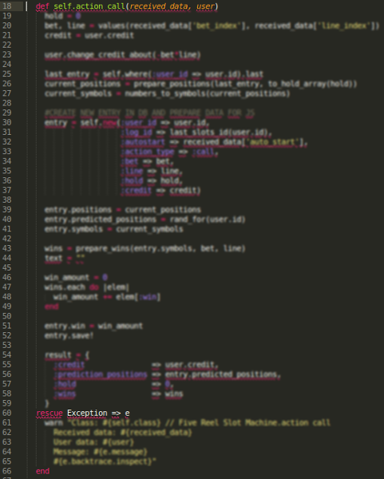

name: inverse
layout: true
class: center, middle, inverse
---
# Human code
[Code as a communication tool]

.footnote[[Alek Małaszkiewicz](http://github.com/torrocus), CEO [Fractal Soft](http://fractalsoft.org)]

???

code = source code

---

layout: false
class: center, middle

# Source code
.red[My code is getting worse, please send **more chocolate**]


???

---

layout: false
.left-column[
  ## Source code
  ### - Computer
]
.right-column[
Computer doesn't do anything without instructions.
Programmer is responsible for source code.
Computer processes the code in two ways:

- **Compiler**:
  1. compiling source code into machine code is a slow process (_developer_)
  2. executing machine code is a fast process (_user_)

- **Interpreter**:
  1. processing and executing the source code can be slow process (_developer & user_)

]

???

**EN**

Compiler transforms source code written in a programming language into machine code. (ANSI C, C++)

Interpreter is a computer program that directly executes. (Bash, Perl, JavaScript, PHP, Ruby, Python)

Variations:
- Bytecode interpreters (Java, ActionScript, Lua)
- Just-in-time compilation (C#)

**PL**

Kompilator tłumaczy kod źródłowy z języka programowania na język maszynowy.

Interpreter analizuje kod źródłowy programu, a przeanalizowane fragmenty wykonuje.

---

layout: false
.left-column[
  ## Source code
  ### - Computer
  ### - Tools
]
.right-column[
People use tools to make your life easier.
**Developers love the tools!**
Need to know why we use them.

Developer tools:

- Revision control ([Git](http://git-scm.com/), [Bazaar](http://bazaar.canonical.com/), [Mercurial](http://mercurial.selenic.com/), [SVN](http://subversion.apache.org/), [CVS](http://cvs.nongnu.org/))

- Testing tools (unit tests, integration tests, etc.)

- Debugging tools

- Software metrics

- Profiling tools

- Source code editor with syntax highlighting

```ruby
def fib(number)
  return number if number < 2
  fib(number - 1) + fib(number - 2)
end
```
]

---

layout: false
.left-column[
  ## Source code
  ### - Computer
  ### - Tools
  ### - Human (developer)
]
.right-column[
Programming languages ​​were created for people.
Computers understand the machine language.
People, not! **Source code for us, developers!**

What it means?

- Our brain interprets what we write.

- Working on the source code, we read it more often than the computer.

- We make mistakes!

**We forgot about the one tool!**
]

---

layout: false
class: center, middle

# The brain
.red[The most **important tool** for any developer!]


???

**PL**

Programujesz? Włącz myślenie!

---

.left-column[
  ## The brain
]
.right-column[
The brain is great, but has limitations.
Let's learn how to help him.
The brain properties:

- likes order

- likes to focus

- likes patterns
]

---

layout: false
class: center, middle

# Order
.red[Garbage in, garbage out]


???

**PL**

Jakie dane takie wyniki. => Jaki kod, taki program.

---

.left-column[
  ## The brain
  ### - Order
]
.right-column[
What does it mean?

** Clean code**

- simple - use [KISS principle](http://en.wikipedia.org/wiki/KISS_principle)

- without repetition - use [DRY](http://en.wikipedia.org/wiki/Don%27t_repeat_yourself)

- clear, easy to understand

- elegant, be proud of it

- effective

- easy to expand
]

???

KISS = Keep it simple, stupid

DRY = Don't repeat yourself

---

template: inverse

# OK, but how to do it?

---

layout: false
class: center, middle

# Principle scouts
## Leave the code cleaner than you found them


---

layout: false
class: center, middle

# Comments
## Don't comment bad code - rewrite it.
_Brian W. Kernighan and P. J. Plaugher_

???

**PL**

Używamy systemów kontroli wersji, a jednocześnie commitujemy zakomentowany kod.

Syllogomania (zespół zbieractwa, patologiczne zbieractwo) - częsta choroba developerów.

---

layout: false

# Comments

- Comments should explain the code that does not explain itself.

- Comments not fix bad code.

- Comments may lie.

- Remove redundant comments.

???

**PL**

Nie używaj komentarza, kiedy możesz to wyjaśnić kodem.
Celem komentarzy jest wyjaśnić kod, który nie wyjaśnia się sam.

Komentarze nie naprawiają złego kodu.

Komentarze mogą zawierać kłamstwa.

Usuwaj nadmiarowe (zbędne) komentarze.

---

layout: false

# Meaningful names

- Don't use shorten names. Don't use too long names.

- Name is wrong, if the required comment.

- Name can be pronounced.

- Class is a noun. Method (function) is a verb.

???

**PL**

# Znaczenie nazw

- Nie używaj skrótów. Często są dwuznaczne. Nie używaj zbyt długich nazw.

- Jeśli nazwa wymaga komentarza to prawdopodobnie jest zła.

- Nazwę można wymówić.

- Klasa to rzeczownik. Metoda to czasownik.

---

.left-column[
  ## The brain
  ### - Order
  ### - Focus
]
.right-column[
The human brain has a limited perception.
We focus on a maximum of two screens of code.
It is good to use standards and rules.

[Simple Coding Standards](https://github.com/fractalsoft/simple-coding-standards):
1. 100 lines / class .red[*]
2. 5 lines / method .red[*]
3. 4 params / method .red[*]
4. 79 characters / line
5. 1 tab indentation / method
6. 1 dot / line
7. 1 instance variable / view .red[*]
]


.footnote[.red[*] Sandi Metz' Rules For Developers]

???

**EN**

Sandi Metz' Rules:
- Classes can be no longer than one hundred lines of code.
- Methods can be no longer than five lines of code.
- Pass no more than four parameters into a method. Hash options are parameters.
- Controllers can instantiate only one object.

---

.left-column[
  ### 1. Too long class
]
.right-column[

]

???

**PL**

360 lini kodu w klasie

Ekran mieści 73 linie z fontem 8pt.

---

.left-column[
  ### 1. Too long class
  ### 2. Too long method
]
.right-column[

]

???

**PL**

48 lini kodu w metodzie

Ta metoda zajmuje pół ekranu!

---

.left-column[
  ### 1. Too long class
  ### 2. Too long method
  ### 3. Too many params
]
.right-column[
```ruby
# first way
def add_contact(firstname, lastname, email, phone, mobile,
      country, city, street, postcode, skype,
      facebook, twitter, github, ...
    )
  ...
end

# second way (problem hidden)
hash = {
  firstname: 'John',
  lastname: 'Smith',
  email: 'john.smith@example.com',
  phone: '123456789',
  mobile: '123456789',
  country: 'Neverland',
  city: 'Capital',
  street: 'Mainstreet',
  postcode: '1234',
  skype: nil,
  facebook: nil,
  twitter: nil,
  github: nil
}

def other_add_contact(hash)
  ...
end
```
]

---

.left-column[
  ### 1. Too long class
  ### 2. Too long method
  ### 3. Too many params
  ### 4. More
]
.right-column[
79 characters / line
```ruby
def very_long_method_name_with_parameters_list(first_parameter, second_parameter, third_parameter)
  ...
end
```

1 tab indentation / method
```ruby
def very_complex_method(array, list, vector)
  array.each do |element|
    list.each do |item|
      vector.each do |number|
        some_method(element, item, number)
      end
    end
  end
end
```

1 dot / line
```ruby
object.some_method.another_method.and_another_method
```
]

???

**PL**

79 znaków w lini działa podobnie jak długość klasy, tylko poziomo trudniej się przewija.

1 wcięcie narzuca niekomplikowanie kodu.

1 kropka pomaga przestrzegać prawo Demeter.

---

.left-column[
  ## The brain
  ### - Order
  ### - Focus
  ### - Pattern
]
.right-column[
Our brain loves patterns.
Sometimes even where there is no patterns.
Let's show him patterns.

Simple rules:

- Not guess, **read the documentation**

- **Convention over configuration**

We always should use convention over configuration.
Let's learn good patterns and use them in different places and technologies.
]

???

**PL**

Nasz mózg podświadomie szuka wzorców.
Czasem nawet tam gdzie ich nie ma.
Pokażmy mu wzorce.

Proste zasady:

- Nie zgaduj, czytaj dokumentację

- Konwencja nad konfiguracją

Zawsze powinniśmy używać konwencji nad konfiguracją.
Nauczmy się dobrych schematów i używajmy ich w różnych miejscach i technologiach.

---

template: inverse
# OK, what's now?
## I use coding standard, patterns & rules.
## Is my code more readable?

---

template: inverse

# readability = _relationship between the code and the reader_

???

**PL**

Czytelność kodu jest relacją między kodem a czytelnikiem.

Istnieje cieńka granica pomiędzy czytelnością kodu a jego zwięzłością.

Można napisać bardzo krótki kod, ale zupełnie nieczytelny.

---

template: inverse

# Brains of all team members operate similarly.
## Source code is the important communication tool.

???

Mózgi wszystkich członków zespołu działają podobnie.

Kod źródłowy jest ważnym narzędziem do komunikacji.

---

layout: false

# Links:

- [http://www.sandimetz.com/](http://www.sandimetz.com/)
- [http://robots.thoughtbot.com/sandi-metz-rules-for-developers](http://robots.thoughtbot.com/sandi-metz-rules-for-developers)
- [https://github.com/fractalsoft/simple-coding-standards](https://github.com/fractalsoft/simple-coding-standards)
- [https://github.com/fractalsoft/definition-of-done](https://github.com/fractalsoft/definition-of-done)

---

name: last-page
template: inverse

## Contact

twitter: @torrocus

facebook: torrocus

github: torrocus
